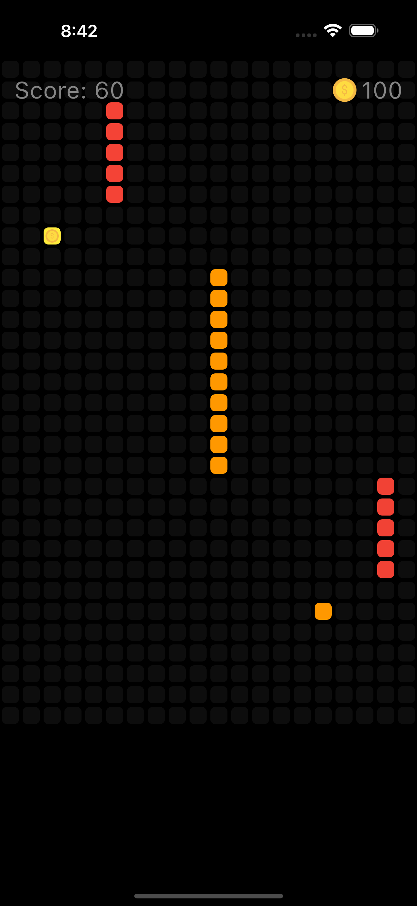
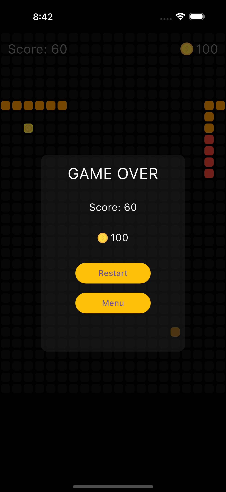

# Flutter Snake Game

A modern implementation of the classic snake game built with Flutter. This project is inspired by the classic "impossible snake game" concept.

## Features

- Classic snake gameplay with modern graphics
- Multiple snake skin options
- Collect coins and food to grow your snake
- Compete against AI bots
- Track your high scores
- Responsive design that works on various screen sizes

## Screenshots

|  |  |  |
|:---:|:---:|:---:|

## Getting Started

### Prerequisites

- Flutter SDK (^3.7.0)
- Dart SDK
- Android Studio / VS Code
- Git

### Installation

1. Clone the repository:

   ```bash
   git clone https://github.com/yourusername/flutter-snake-game.git
   ```

2. Navigate to the project directory:

   ```bash
   cd flutter-snake-game
   ```

3. Install dependencies:

   ```bash
   flutter pub get
   ```

4. Run the application:

   ```bash
   flutter run
   ```

## How to Play

- Swipe to change the direction of your snake
- Collect food to grow your snake and increase your score
- Avoid colliding with walls and other snakes
- Collect coins for bonus points and unlocking features
- Try to survive as long as possible and achieve the highest score

## Technologies Used

- Flutter framework
- Provider for state management
- Shared Preferences for local data storage
- Custom animations and graphics

## Game Structure

The game is structured into several key components:

- Snake model: Manages the snake's properties and movement
- Board model: Handles the game board and collision detection
- Game logic: Controls game flow, scoring, and interactions
- User interface: Renders the game elements and handles user input

## Contributing

Contributions are welcome! Please feel free to submit a Pull Request.

1. Fork the repository
2. Create your feature branch (`git checkout -b feature/amazing-feature`)
3. Commit your changes (`git commit -m 'Add some amazing feature'`)
4. Push to the branch (`git push origin feature/amazing-feature`)
5. Open a Pull Request

## Acknowledgments

- Original impossible snake game concept
- Flutter community for their valuable resources
- All contributors who have helped improve this game
